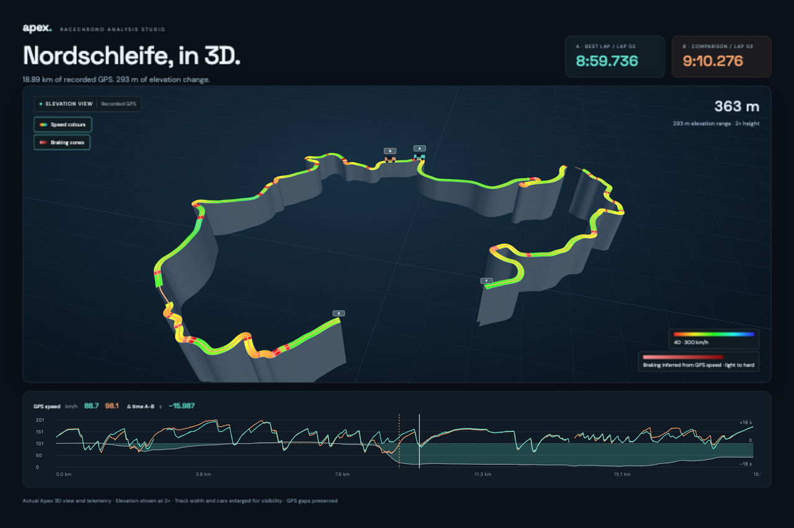

# Apex · RaceChrono analysis studio

A local browser workspace for RaceChrono sessions, GPS traces, cross-session lap comparisons, customizable telemetry charts, sector-based theoretical laps, and synchronized local videos.



*Recorded Nordschleife BTG laps, shown with speed colours, estimated braking zones and 2× elevation. GPS gaps remain visible.*

## Run

```sh
npm install
npm run dev
```

Open http://localhost:5173. Drop `.rcz` files anywhere on the window or use **Import sessions**. A dashed overlay confirms the drop target. Each session joins the collection under the track named in its file, and the Sessions tab groups it there. A session on a track you had not imported before also opens the analyzer on that track, on its fastest lap. Dropping the same recording again refreshes it rather than adding a copy. Every file is handled on its own, so one bad file is reported without stopping the others. Videos are skipped with a note, because they are linked from Video sync. `.apex.zip` projects and `.rcsync.json` files can be dropped the same way. `npm run build` produces the static site in `dist/`. Serve it over HTTPS or localhost for persistent file handles and offline app caching. No application backend is needed.

The development server can offer an **Open local recordings (development)** button. Point it at your own files with an untracked `.env.local`, for example `APEX_LOCAL_SESSIONS=/path/a.rcz,/path/b.rcz`, and list extra hostnames for the server in `APEX_ALLOWED_HOSTS`. These recordings are served only by the Vite dev server and are never part of `public/` or the production build. Deploy `dist/`, not the development server.

## Analysis

Choose A and B from different sessions, then use **+ Add lap** to compare up to four more laps against A, called C to F. Each has its own color and can be a real lap or the theoretical optimal, and each is removed with ×. Every added lap gets its own trace and car on the map, its own line in every chart, its own column in the hover box, and its own delta line and readout against A. The shaded delta fill follows lap B, or the first added lap when B is empty. Videos still follow A and B only. Charts, GPS markers and videos share the cursor. Hovering a chart shows a dashed cursor with the values of every lap at that distance, starting with the time of day of each lap at that point, in local time to a tenth of a second, taken from the GPS timestamps in the RaceChrono recording, and translucent ghost cars on the map at the same point on every lap, red where that lap is braking. Hovering does not move anything, and the ghosts disappear when the pointer leaves the chart or while you drag out a zoom range. Click a chart to move the shared cursor. The left and right arrow keys move lap A by 0.05 s of lap time, and Shift moves 10 times as far, 0.5 s. The step is in time, so a slow corner moves fewer metres than a straight, and a stop is crossed at the same pace: the lap clock keeps counting while the car stands still. Type a lap time such as `85:40` into the clock and press Enter to jump straight to that moment. Playback also runs on time, so it plays through a stop. The keys work on the Analyze and Video sync tabs, stop at the ends of the lap or of a zoomed range, and leave dropdowns and sliders alone when one has focus. Two buttons on the map act on lap A. **Braking zones** draws the stretches where lap A is braking, light red where the braking is weakest, at the start and the end of a zone, and dark red where it is strongest. If the file has a brake channel (a VBO column or a logged channel with "brake" in its name) that is used: on above 10% of its highest value in the lap, coloured by how far it is pressed. RaceChrono archives do not name their channels, so none of them is recognised yet. Otherwise it is calculated from GPS speed: deceleration of 0.2 g or more, coloured up to 1.2 g, and only where the car sheds at least 12% of its entry speed. GPS speed alone cannot tell braking from lifting off, and a car coasting from 160 km/h slows by 0.3 to 0.5 g, so a slowdown smaller than that is not shown as a braking zone. The g value is averaged over a few samples so the colour changes steadily. Gaps under 15 m are closed and stretches under 8 m ignored. The car on the map turns red by the same rule. **Speed colours** colours the trace by GPS speed from red at 40 km/h to blue at 300 km/h, with the scale shown under the buttons; the scale is the same in mph. With both on, the braking zones sit on top of the speed colours. On the map, click within about 30 pixels of either trace to do the same; a click farther away is ignored. Drag across a chart to zoom, or scroll the mouse wheel over it to zoom in and out around the pointer; Shift with the wheel moves the zoomed window sideways. Playback does not stop at the edge of a zoomed section: it carries on to the end of the lap and the window scrolls along, holding the cursor about 60% of the way across, and the map follows it. Space plays and pauses from anywhere on the Analyze and Video sync tabs, except while typing in a field or a dropdown. It also works when a button has focus, and does not press that button. Pressing Play at the end of the lap starts again from the beginning. Charts that include speed show the cumulative time delta between laps A and B as a faded background line, on its own scale printed at the right edge: above the dashed zero line A is behind, below it A is ahead. The delta is the difference of elapsed times at the same distance, so it ends at the difference of the two lap times. Add and overlay channels, reorder charts, resize panels, and change speed units and lap colors. Elapsed-time replay advances both laps by the same duration; the charts retain their distance axes and show separate cursor positions.

The Sessions view shows a lap's status only when something needs your attention or you have made a decision: **Needs review**, **Can't be used**, **Marked valid** or **Excluded**. A lap with no problem, or from a track other than the one being analyzed, shows nothing but **Analyze**, and minor notes such as a GPS gap appear as small text. Every lap counts by default, including laps with GPS outages and laps interrupted by a red flag. Only sectors that overlap an outage of more than 2 seconds are skipped, and a sector where the car stood still is never the fastest. **Review**, shown on laps with a status or a note, opens a dialog that explains each flag in plain words and shows the theoretical lap without and with that lap, and how many sectors the lap would win. Nothing changes until you press **Mark as valid**, **Exclude from optimal** or **Back to automatic**. The choice is saved on this device with your other settings and travels in Export project. Laps RaceChrono marked invalid and laps with incomplete GPS coverage need your review before they count. A lap that does not line up with the reference cannot be forced in, because its sectors would be measured against the wrong stretch of track. A lap from another track is not a problem: the analyzer compares one track at a time, so it is simply not part of the current analysis.

The map shows lap A and lap B with a small car each, rotated to the direction of travel. A car turns red while its longitudinal acceleration, calculated from GPS speed, is at or below -0.2 g.

The theoretical optimal is the sum of the fastest usable sectors across the selected collection. It depends on the sector count: for the 11 laps of the 27 September track day it is about 8:39.5 with 19 sectors and lower with more. Every sector names its source lap. Approximately 1 km sectors are generated when none exist. Edit their distances, add a gate at the cursor, or change the custom timed section's start and finish. Imported RaceChrono lap boundaries stay unchanged. Sector joins can involve different speeds and lines; the result is not a physically validated achievable lap.

Use **3D elevation** above the analysis map to view the recorded GPS track in perspective. Drag to orbit, scroll or pinch to zoom, and click the track to move the shared cursor. Playback moves the cars along the elevated track, including comparison laps; chart hovers show ghost cars. Speed colours and braking zones use the same rules as the 2D map. **Elevation** changes the vertical scale from 1× to 5×; 1× uses the recorded height in metres. Track width and cars are enlarged for visibility. This is a GPS ribbon, not a terrain or surveyed road model. Missing GPS or altitude sections remain gaps. With no altitude channel the view explicitly shows a flat track. **2D map** returns to the existing street map.

Telemetry charts with no finite values in any selected lap are hidden automatically. **Show empty charts** reveals them without removing saved chart settings. Channels containing zero values still count as data.

Drag across a chart to select a section, then enable **Loop section** to replay that window repeatedly. Turn it off to resume normal playback; **Reset zoom** also clears looping. **Playback speed** offers 0.25×, 0.5×, 1× and 2× for telemetry, cars and synchronized video.

With a recorded lap in B, open **Braking points** to see the braking starts of A and B on either map and compare their distances. Select a row to inspect that section. Each lap is labelled as recorded brake or estimated from GPS speed. Onsets are matched only when they are mutual nearest points within 100 m; other points remain unmatched. No onset is inferred immediately after a GPS outage. These are comparisons of detected points, not advice to brake later.

**Lap times** in Sessions now includes **Lap consistency**, with the fastest-to-slowest spread, standard deviation, median and lap count. Interrupted, invalid, incomplete GPS laps and laps with GPS outages are omitted from this statistic. This does not change optimal-lap eligibility.

## Sessions, groups and summaries

Use the **×** at the top right of a session card to remove it from this browser. Confirm the filename before removal. Its stored recording, laps, lap selections and video sync are removed; original files on disk stay untouched. Shared video links used by other sessions are kept. Import the original recording again to bring it back.

The Sessions tab groups recordings **by track** or **by date**. The choice is remembered. Each session has an **Include in analyzer** checkbox, and each group header has a checkbox that selects or clears the whole group, so you can combine sessions from different days on the same track. **Analyze only these** selects one group and opens the analyzer. The sidebar lists the same sessions in one group per track, with the track name and session count as a heading. Only the sessions inside a group have checkboxes, and they edit the same selection. Clicking a track heading sets the analysis on that track: it keeps the ticked sessions of that track, or ticks all of them when none is ticked, clears the other tracks, switches to the track's fastest lap and opens the Analyze tab. At least one session stays selected. An empty selection in storage means every session, so a newly imported session joins automatically.

The selection scopes the lap pickers, the best recorded lap and the theoretical optimal lap. The analyzer compares laps on one track at a time. If the selection spans several tracks, a notice names the current track, and picking a lap from another track in Lap A switches to it.

**Change track** on a session card puts the session on another track if the app matched it wrongly: pick one of the tracks in use, or type a new name. A VBO session has its laps cut again from the new track's finish line when one is known, and loses them, with a prompt to place a line, when it is not. RaceChrono sessions keep the laps from their file. Your choice is deliberate: automatic matching leaves it alone, importing the same file again keeps it, and Export project carries it.

Click a session card, or **Lap times**, for a summary in the style of a timing screen: top speed while timing, lap count, best lap, every lap with its gap to the best, and an **opt** row with the best sectors of that session. Click a lap to analyze it. The opt row uses this app's sector calculation when the session is on the track being analyzed, and otherwise the value RaceChrono stored, labelled as such.

The **Optimal lap** tab shows **Opportunities**: the fastest lap against the best sectors of every lap in scope, drawn on the track outline with the time to gain per sector, ranked below, with arrows to step through them. The scope is the ticked sessions when you have made a selection, otherwise all sessions of one day, which you can change in the panel. Sector gains are measured against the fastest lap, so they add up to its lap time minus the optimal, apart from sectors where that lap crossed a GPS outage.

## Video and portable synchronization

1. Select laps, open **Video sync**, and choose local MP4, MOV, or WebM files. Browser codec support determines what can play. H.264 MP4 is a useful default. HEVC (H.265), which many cameras and phones record, plays in Safari and in Chrome only with hardware support. Convert it with `ffmpeg -i input.MP4 -c:v libx264 -crf 23 -an output.mp4`.
2. The files are streamed from their local object URLs. They are never uploaded or stored in IndexedDB. A video is identified by its SHA-256, calculated once in a worker using 4 MB chunks, which takes a few seconds per gigabyte. The result is remembered in the browser against a fingerprint of the file (its size, modified time, and a hash of its first and last megabyte), so refreshing the page and pressing Reload video recognises the same file in under a second without reading it through again. A file whose fingerprint has not been seen is hashed in full.
3. When the first video of a session is opened, the app reads the recording time stored in the file and, if it falls inside the session, places the video on the telemetry clock by itself and jumps there. Cameras disagree on whether that time is UTC or local wall-clock, so the reading that fits the session is used, and the note says when both fit. Many files carry the time they were exported instead of the time they were recorded, for example a clip cut and saved in a video editor. The app then says so and opens the manual editor.
4. In **Adjust sync** the panel shows a status line (Synced or Not synced yet) and three steps: pause the video on a moment you recognise, put the telemetry on the same moment, and press the green **Sync here**. Step 2 has its own lap-time box: type `85:40` and press Enter, or click the map or a chart, or use the arrow keys. When you press **Sync here** the button turns into a green **Synced**, the picture flashes, and a banner says exactly what was linked, for example `Video 29.9 s is now linked to lap time 1:26:07.6 (15:40:58.0)`.
5. **Other ways to sync** is a collapsed section for the less common cases. **Video started at** is an editable field: type the local time the video started, for example `14:10:04` or `14:10:04.500`, or `2026-09-27 14:10:04` for another day, and press Enter. The panel then shows when the GPS data and the video each begin and end, and where they overlap; the video may start before the GPS data or end after it, and only the overlap has both. **Show where video and GPS overlap** jumps there. **Link this frame to GPS start** ties the frame you have paused on to the moment the GPS data begins. **Add drift correction** syncs a second time further along a long video. With several clips the section also has the clip picker and where each clip starts. Typing a start time replaces any drift correction.
6. One video can cover several laps of a session, for example a 20-minute recording of six laps. Sync is stored per session against the clock, so lap A and lap B each show the same video at their own moment, and the theoretical lap shows it at the moment of each sector's source lap. **Reload video** picks the same file again, for example after reloading the page, and refuses a different file so it cannot corrupt the saved sync. **Replace video** switches the session to a different video and discards the old sync. **Add next clip**, under Other ways to sync, adds the next file of a recording that a camera split. When the cursor is outside the video, the panel says when the video covers and offers a button that jumps to its start. A synced video that is out of view is also brought into view when you reload, replace or add a video. Files over 2 GB work: a 2.8 GB, 38-minute HEVC recording was checked in Chrome, including seeking past the 2 GB mark.
7. Camera chunks are initially ordered by natural filename order. Their recording start times can be edited to represent gaps. The two panels follow their own lap timestamps.
8. Download `.rcsync.json` for a small sidecar containing session and video filenames, sizes, SHA-256 hashes, clip order, duration, and anchors. It contains no session or video bytes.
9. Reopen the sync file. Sessions already in IndexedDB are reused. Import missing RCZ files and reselect videos when necessary. A matching hash accepts a renamed video; the saved binding is not overwritten by a wrong file. Use **Unlink** to remove an old binding before replacing the recording with different footage.

**Download session file** creates `.apex.zip` with the complete original RCZ/VBO files, layout, chart settings, and video sync data. It excludes video contents. Reimport opens a review dialog with GPS counts, channels, laps and video links before anything is committed. Choose the original local videos in that dialog to restore playback; full hashes also recognize renamed originals. Use it as the portable backup; browser storage can be cleared by the browser or user. Wait for **Saved locally** before closing. File handles are reused where supported and permission is granted. HTTP previews may require manual reselection.

The video sync panel offers matching frames, braking events, recording time, embedded GPS UTC and GPS route matching. Choose GoPro GPMF, DJI metadata or Insta360 trailer/CAMM per clip, or detect the format. Only recorded accelerometer samples supply camera G-forces; gyro and fusion orientation describe rotation. DJI Action 4/5/6 accelerometer/GPS schemas are supported. Insta360 trailers support raw and floating-point IMU and GPS with a timing reference; retimed files are rejected. CAMM supports motion and GPS route matching; GPS epoch values are not assumed to be UTC. Original camera files are needed when app exports remove telemetry. Browser codec support determines playback.

The format uses `format: "apex-sync"`, `version: 1`, and `bindings[]`. Each binding has a `session` identity, ordered `clips[]`, and zero to two `anchors[]` with `videoSeconds` and Unix `sessionTimestamp` in milliseconds. One anchor defines offset; two define an affine time mapping. Project format is `apex-project`, version 1.

## Data and track catalog

## Tracks

The Tracks tab lists **your tracks**, one for each track your sessions belong to, with sessions, laps, best lap and length. Select one and the map shows its fastest lap as a bold trace, the fastest lap of each other session as a faint one, the sector gates when it is the track being analyzed, and the **start/finish line** as a checkered bar with its label and an arrow for the direction of travel. The bar keeps its size on screen, so it stays visible when the whole circuit is in view. A line note says where the line comes from: placed by you, taken from another session, where the laps begin in the recordings, or the start of the fastest lap when nothing else confirms it. A session that has no laps yet still shows its path, without a line. From here you can analyze the track, edit its layout, and place or move the start/finish line of a VBO session.

**Find a circuit in the catalog** is a secondary search that pins a venue on the map and does not disturb your own track; **Back to my track** returns. The included snapshot contains 6,643 named mapped raceways from OpenStreetMap. It is global but not exhaustive, and can include kart tracks and individual circuit sections. Search results are venue locations, not certified timing layouts. GPS imports supply the timed reference. Regenerate the snapshot with:

```sh
npm run catalog
```

Catalog data © OpenStreetMap contributors, ODbL 1.0. See https://www.openstreetmap.org/copyright. The script uses a single Overpass request; failed requests preserve the previous snapshot. Street-map tiles use OpenStreetMap's standard server with visible attribution and normal browser caching. There is no tile prefetch. Production caches the application shell for offline telemetry use; map tiles and external fonts require connectivity or an existing browser cache.

## VBO files

Racelogic VBO files import the same way as `.rcz`, including by dropping them on the window. This covers what VBOX loggers, Dragy, RaceChrono and other tools write: time as `HHMMSS.sss` in UTC with the date taken from the file's text, coordinates in minutes of arc with west positive, and speed in km/h or mph. Speed, heading, height and satellites map to the usual channels, and any other numeric column shows as a raw column. Rows that do not parse are skipped and counted. The format was verified on a Dragy Lap export.

A VBO normally has **no laps and no track ID**, so both are worked out:

- **Track.** The name comes from the filename, for example `dragylap_20250418_165151_Salzburgring.vbo` is Salzburgring. A finish line from another session that lies on the same path identifies the track, and the VBO joins it. A RaceChrono session of the same name that arrives later takes the VBO in too, whichever came first.
- **Laps.** Laps are cut where the path crosses a start/finish line in its direction of travel, to a fraction of a sample. The line comes from another session of that track, from where its laps begin. If none is known, the session imports with no laps and a prompt, and **Set start/finish line** opens a map where you click the track. The result is shown live, for example `18 laps found. Best 1:34.774`, before you keep it. **Move start/finish line** changes it later. A line you placed is kept when the same file is imported again and travels in Export project. In a mixed drop the RaceChrono sessions are read first so their lines are known.
- **Accuracy.** On a real Dragy file of Salzburgring the finish line from a RaceChrono session gave 18 laps with a best of 1:34.774, and moving the line 25 m along the track changed the best by 0.004 s. Lap times follow the line, so a VBO lap can differ slightly from what the device's own app showed if its line sat elsewhere.

RCZ decoding is verified against the two supplied version-1 archives. GPS coordinates use signed fixed-point values divided by 6,000,000; timestamps are little-endian int64 milliseconds. GPS speed is mm/s and is converted to km/h; altitude is mm. Recognized OBD float64 channels are RPM, throttle, coolant, intake temperature and speed. Other structurally supported channels are exposed as raw values with no invented units. Original archive entries remain preserved. The lap RaceChrono lists without a finish time, because recording stopped during it, is skipped as untimed. Other RCZ variants may require additional decoder support and produce an explicit error.

## Validation

```sh
npm test
npm run build
```

Tests that need real RaceChrono recordings are skipped unless `APEX_FIXTURES` names a folder that holds them. See the comment at the top of `src/core.test.ts` for the expected file names. Recordings are private and are not in this repository. Synthetic tests cover interpolation, sector logic, grouping, file classification and portable sync validation. See `VALIDATION.md` for browser evidence and limitations.

## Optional: a persistent HTTPS service on a Mac with Tailscale

This is how the maintainer keeps a copy running. It is optional; the app is static and any static host over HTTPS or localhost works.

`npm run deploy` builds the app, copies `dist/` to a runtime folder, restarts a macOS LaunchAgent that runs `scripts/serve.mjs` on `127.0.0.1:5180`, and checks that the service serves the new build. Tailscale Serve terminates HTTPS in front of it, tailnet only. HTTPS is a secure context, which browsers need for the offline cache and persistent file handles.

1. Create the runtime folder and a LaunchAgent (label `local.apex.racechrono` by default) that runs `node "<runtime>/serve.mjs" "<runtime>/web"`, with the runtime folder as its working directory. The default runtime folder is `~/Library/Application Support/ApexStudio`.
2. Map an HTTPS port to the loopback server, and remove it later with `--https=5173 off`:

   ```sh
   tailscale serve --bg --https=5173 http://127.0.0.1:5180
   ```

3. Put your address in an untracked `.env.deploy`, for example `APEX_PUBLIC_URL=https://my-host.my-tailnet.ts.net:5173`. `APEX_RUNTIME` and `APEX_LABEL` override the defaults.
4. Run `npm run deploy` after every change.

The service serves only the production build. The development-only recording endpoints are not exposed. Browser storage is tied to the exact origin, so sessions saved under one address do not appear under another. Move them with **Download session file** and **Import sessions**.

## Data and license

Application code: MIT, see `LICENSE`. The included track catalog is derived from OpenStreetMap and is licensed under the Open Database License 1.0. Attribution: © OpenStreetMap contributors, https://www.openstreetmap.org/copyright.

RaceChrono recordings, GPS traces and videos are personal data. The repository contains none. The app keeps them in your browser; saving to Google Drive uploads the session archive you choose to save. Videos stay local. Do not commit recordings.

## Optional Google Drive storage

The **Google Drive** button connects a user's Google account, saves a new portable session archive to their Drive, lists app-created archives and opens one through the same review dialog as a local import. Saves include complete RCZ/VBO recordings and video timing. Videos stay local. **Save to Drive** updates the current app-created file; **Save a new copy** keeps a separate archive. The header provides a direct save button. Optional autosave runs after 30 seconds without changes while the tab is open and connected. New saves can use My Drive, an existing folder chosen through Google Picker, or a newly created folder. Changing the folder starts a new saved file without moving existing files. The app does not delete Drive files. A version check stops a save when the current file has changed elsewhere; open that version or save a separate copy. This is a pre-upload check, not an atomic multi-device merge.

Configure a Google **Web application** OAuth client in the intended Cloud project, enable the Drive API, and register the exact HTTPS site origin (plus your localhost development origin when needed). The Google Auth Platform consent configuration must allow the intended users and the `https://www.googleapis.com/auth/drive.file` scope. Use the site's `/privacy.html` page for the app's data policy. If the Google app is in testing mode, add the intended accounts as test users.

Put `VITE_GOOGLE_CLIENT_ID` in untracked `.env.local` for development and in a build secret for deployment. The client ID is a public browser identifier; client secrets, account credentials and access tokens do not belong in the frontend. Google Identity Services provides a short-lived token after an explicit user action. The app keeps that token in memory and tab-scoped session storage until its original expiry, retaining it across refreshes in the same tab. It remembers per-account folder, current file, autosave preference and file-list metadata in local storage; it does not put tokens in persistent local storage or session archives. After expiry or closing the tab, reconnect with one click. Google may still ask you to sign in or choose an account. Unattended access across visits would require a backend with securely stored refresh tokens. No client secret, service account or application backend is required. Without a configured client ID, local download/import remains available and Drive displays its setup status. Browser builds read only `.env.local` and explicit environment variables for the two public Google configuration values; generic `.env` files are not read.

For folder browsing, enable the Google Picker API in the same project. Configure `VITE_GOOGLE_PICKER_API_KEY` with a browser API key restricted to the Picker API and your actual site referrers. Picker uses the project number from the OAuth client ID and retains the `drive.file` scope, so it does not request access to the entire Drive. Without the Picker key, users can still save in My Drive or create a new folder.

## Cloudflare Pages deployment

Publish only `dist/`. The `deploy:pages` script reads the API token from the environment or a local credential file, and account/project/public-address settings from the environment or untracked `.env.pages`. Required keys are `CLOUDFLARE_API_TOKEN` (or `CLOUDFLARE_TOKEN`), `CLOUDFLARE_ACCOUNT_ID`, and `CLOUDFLARE_PAGES_PROJECT`. `CLOUDFLARE_TOKEN_FILE` can point at a separate credential file. `APEX_PAGES_PUBLIC_URL` enables verification of the exact built JavaScript asset at the public address.

The GitHub workflow runs tests and a build on pull requests. On `main` it deploys using repository secrets `CLOUDFLARE_API_TOKEN`, `CLOUDFLARE_ACCOUNT_ID`, and optional `VITE_GOOGLE_CLIENT_ID` and `VITE_GOOGLE_PICKER_API_KEY`, plus repository variables `CLOUDFLARE_PAGES_PROJECT` and `APEX_PAGES_PUBLIC_URL`. Pull request validation receives no deployment credentials. Create the Pages project and attach its intended custom domain before the first upload. The existing local HTTPS service remains a separate deployment.
